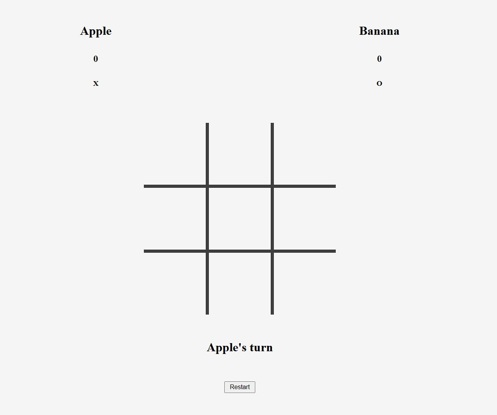

# Tic-Tac-Toe

Web-based two player game of Tic-Tac-Toe

Built as part of [The Odin Project](https://www.theodinproject.com/) curriculum to practice **DOM Manipulation**, **Factory Functions** and **Javascript Objects**.

## Features

- Play Tic Tac Toe with two players in the same browser
- Automatically displays results (wins and ties)
- User-inputted names

## Demo

### [Live Demo](https://songzhang015.github.io/project-9-tic-tac-toe/)

## Built Using

- HTML
- CSS
- Javascript
